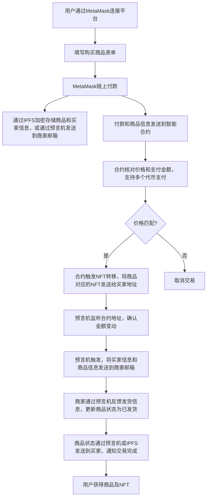

# DiagonAlley 

---

**DiagonAlley** 是基于 **Ethereum** 的支付工具，通过前端的**MVP****RWA**平台演示支付过程。

结合了 **区块链支付**、**智能合约**、**NFT** 和 **RWA** 的交付机制。

该平台允许用户通过 **MetaMask** 进行支付，购买 NFT 表示的商品。商家通过智能合约控制商品交付，确保交易透明、安全，并通过 **ERC 技巧** 降低 **Gas** 费用。

---

### 功能特性

1. **MetaMask 支付与鉴权**：用户通过 **MetaMask** 钱包连接平台进行身份验证与支付，无需额外的登录或注册步骤。
2. **RWA 集成**：真实资产通过智能合约与 NFT 链上表示，用户可以购买实体商品，商品的所有权通过 NFT 转移。
3. **智能合约管理**：智能合约用于价格验证、NFT 铸造与转移，支持多种加密货币支付。
4. **预言机集成**：通过预言机监听链上事件，确保价格变动的实时更新。
5. **支付**：支持多种加密货币支付，使用预言机进行实时汇率计算和价格调整。

---

### 技术栈

- **前端**：React.js, Web3.js, MetaMask API
- **后端**：Go, Gin 框架
- **数据库**：MongoDB（存储交易历史和交易数据）
- **智能合约**：Solidity, Foundry 开发框架
- **文件存储**：IPFS
- **预言机**：Chainlink
- **交易中继**：Gas Station Network（实现无 Gas 体验）

---

### 工作流程



---

### 智能合约细节

- **开发工具**：使用 **Foundry** 开发与测试智能合约。
- **标准**：采用 **ERC-721** 或 **ERC-1155** 标准进行 NFT 铸造与转移。
- **定价与支付**：通过链上 **预言机** 进行价格动态调整，支持多种加密货币支付。
- **Gas 优化**：通过批量交易和懒铸造减少 Gas 消耗，实现无 Gas 体验。

---

### 后端架构

- **后端语言**：使用 **Go** 和 **Gin 框架** 搭建后端服务。
- **数据库**：使用 **MongoDB** 作为后端数据库，存储用户信息、交易历史和 NFT 元数据。
- **文件存储**：商品图片和其他元数据存储在 **IPFS**，确保文件去中心化且可验证。

---

### 部署与运行

1. **克隆项目代码**：
    ```bash
    git clone https://github.com/your-repo/DiagonAlley.git
    cd DiagonAlley
    ```

2. **安装后端依赖**：
    ```bash
    go mod download
    ```

3. **启动后端**：
    ```bash
    go run main.go
    ```
    后端服务将在 `http://localhost:2333` 运行。

4. **编译智能合约**：
    使用 **Foundry** 进行编译和部署：
    ```bash
    forge build
    forge script deploy.s.sol:DeployContract --rpc-url <NETWORK_URL>
    ```

5. **启动前端**：
    ```bash
    cd front
    npm install
    npm run start
    ```
    前端应用将在 `http://localhost:3000` 运行。

6. **配置预言机**：
    确保 **Chainlink 预言机** 已配置好，并在智能合约中添加预言机合约地址。

---

### 开发注意事项

- 确保用户的 **MetaMask** 连接到正确的区块链网络。
- 智能合约部署完成后，更新合约地址到前端配置中。
- MongoDB 用于存储和检索交易记录，以支持 RWA 资产的交易和追踪。

---
```
.
|-- README.md                  # 项目的主要文档，描述项目概述、使用方法和配置指南
|-- flow.png                   # 项目流程图，可视化展示用户交互和系统流程
|-- front                      # 前端目录，包含所有前端相关文件
|   |-- README.md              # 前端部分的文档，说明前端项目的设置和运行方式
|   |-- next-env.d.ts          # Next.js 的 TypeScript 声明文件
|   |-- next.config.mjs        # Next.js 的配置文件，使用 ES Module 格式
|   |-- node_modules           # 包含所有前端依赖的 node 模块
|   |-- package-lock.json      # 确保所有安装的包的版本一致性
|   |-- package.json           # 前端项目的依赖和脚本
|   |-- postcss.config.mjs     # PostCSS 的配置文件，用于处理 CSS
|   |-- src                    # 前端源代码目录，包含 React 组件和页面
|   |-- tailwind.config.ts     # Tailwind CSS 的配置文件
|   `-- tsconfig.json          # TypeScript 的配置文件
|-- back                       # 后端目录，包含所有后端服务相关文件
|   |-- go.mod                 # Go 语言的模块依赖文件
|   |-- go.sum                 # Go 语言的模块依赖校验文件
|   |-- main.go                # 后端服务的入口文件，配置和启动 Gin 服务器
|   `-- controllers            # 控制器目录，用于处理不同的业务逻辑
|       `-- purchaseController.go  # 处理购买请求的控制器
|-- contracts                  # 智能合约目录，包含所有 Solidity 合约文件
|   |-- DiagonAlley.sol        # 主要的智能合约文件
|   `-- script                 # 包含部署脚本的目录
|       `-- deploy.s.sol       # Foundry 部署脚本
|-- foundry.toml               # Foundry 的配置文件，用于智能合约的编译和部署
`-- scripts                    # 脚本目录，包含其他自动化脚本
    `-- deploy.js              # 使用 JavaScript 编写的部署脚本，可能用于辅助部署或测试
```