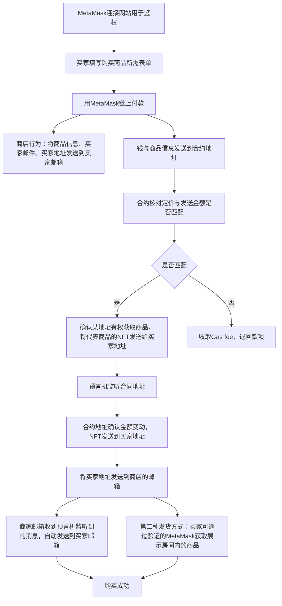

# MetaMaskPay
- 1 MetaMask连接网站用于鉴权，
- 2 买家填写购买商品所需表单。用MetaMask链上付款。
- 3 商店后台：将 商品信息、买家邮件、买家地址 发送到 卖家邮箱。
- 4 钱 与 商品信息 ，发送到合约地址，合约核对设定价格与发送金额是否匹配。
- 5 如果匹配，确认某地址有权获取商品，将代表商品的NFT发送给买家地址。如果不匹配，收取Gas fee，退回货款。
- 6 预言机 监听合约，将地址发送到商店的邮箱，邮箱收到预言机监听到的消息自动发货到买家邮件，第二种发货方式是使用已验证的MetaMask可以登录特定的展示界面获取商品。

## 智能合约地址收款：
  ① 所有地址相互兼容的链只需要一个地址收款。
  ② 在监听uniswap等DEX的情况下可以实现动态调整收款金额，收各种等值山寨币，智能合约可以及时将山寨币卖出获取稳定币。
