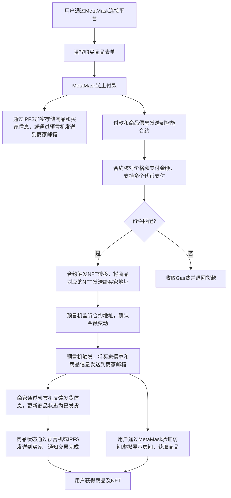

# DiagonAlley

### 项目简介
**DiagonAlley** 是在ETH上的一个结合了 **区块链支付**、**智能合约**、**NFT** 和 **RWA**的支付发货机制
该平台允许用户通过 **MetaMask** 进行链上支付，购买对应的NFT商品，
商家通过智能合约管理商品的交付。系统支持不同加密货币支付，确保交易透明安全，同时一些ERC技巧减少Gas费用。

### 功能特性
1. **MetaMask 支付与鉴权**：用户通过 **MetaMask** 钱包连接平台进行身份验证与支付。
2. **RWA集成**：真实资产通过智能合约和NFT链上表示，用户可以购买实体商品，商品的所有权与交付通过NFT进行转移。
3. **智能合约管理**：智能合约用于价格验证、NFT铸造与转移、自动退款等。
4. **预言机集成**：通过预言机监听链上事件，自动完成交易和发货流程。
5. **支付**：支持多种加密货币支付，预言机监听价格变动，实现实时价格变化。

### 技术栈
- **前端**：React.js, Web3.js, MetaMask API
- **后端**：Go, Gin 框架
- **数据库**：MongoDB（存储用户信息和交易历史）
- **智能合约**：Solidity, Foundry开发框架
- **文件存储**：IPFS
- **预言机**：Chainlink
- **Layer 2 支持**：Optimism, Arbitrum
- **交易中继**：Gas Station Network（实现无Gas体验）

### 工作流程



### 智能合约细节
- **开发工具**：使用 **Foundry** 开发与测试智能合约。
- **标准**：采用 **ERC-721** 或 **ERC-1155** 标准进行NFT铸造和转移。
- **定价与支付**：通过链上 **预言机** 进行价格动态调整，支持多种加密货币支付。
- **Gas优化**：通过批量交易和懒铸造减少Gas消耗，实现无Gas体验。

### 后端架构
- **后端语言**：使用 **Go** 和 **Gin 框架** 搭建后端服务。
- **数据库**：使用 **MongoDB** 作为后端数据库，存储用户信息、交易历史和NFT元数据。
- **文件存储**：商品图片和其他元数据存储在 **IPFS**，确保文件去中心化且可验证。

### 部署与运行

1. **克隆项目代码**：
    ```bash
    git clone https://github.com/your-repo/DiagonAlley.git
    cd DiagonAlley
    ```

2. **安装后端依赖**：
    ```bash
    go mod download
    ```

3. **启动后端**：
    ```bash
    go run main.go
    ```
    后端服务将在 `http://localhost:8080` 运行。

4. **编译智能合约**：
    使用 **Foundry** 进行编译和部署：
    ```bash
    forge build
    forge script deploy.s.sol:DeployContract --rpc-url <NETWORK_URL>
    ```

5. **启动前端**：
    ```bash
    npm install
    npm run start
    ```
    前端应用将在 `http://localhost:3000` 运行。

6. **配置预言机**：
    确保 **Chainlink 预言机** 已配置好，并在智能合约中添加预言机合约地址。

### 开发注意事项
- 确保用户的 **MetaMask** 连接到正确的区块链网络。
- 智能合约部署完成后，更新合约地址到前端配置中。
- MongoDB用于存储和检索交易记录，以支持RWA资产的交易和追踪。
