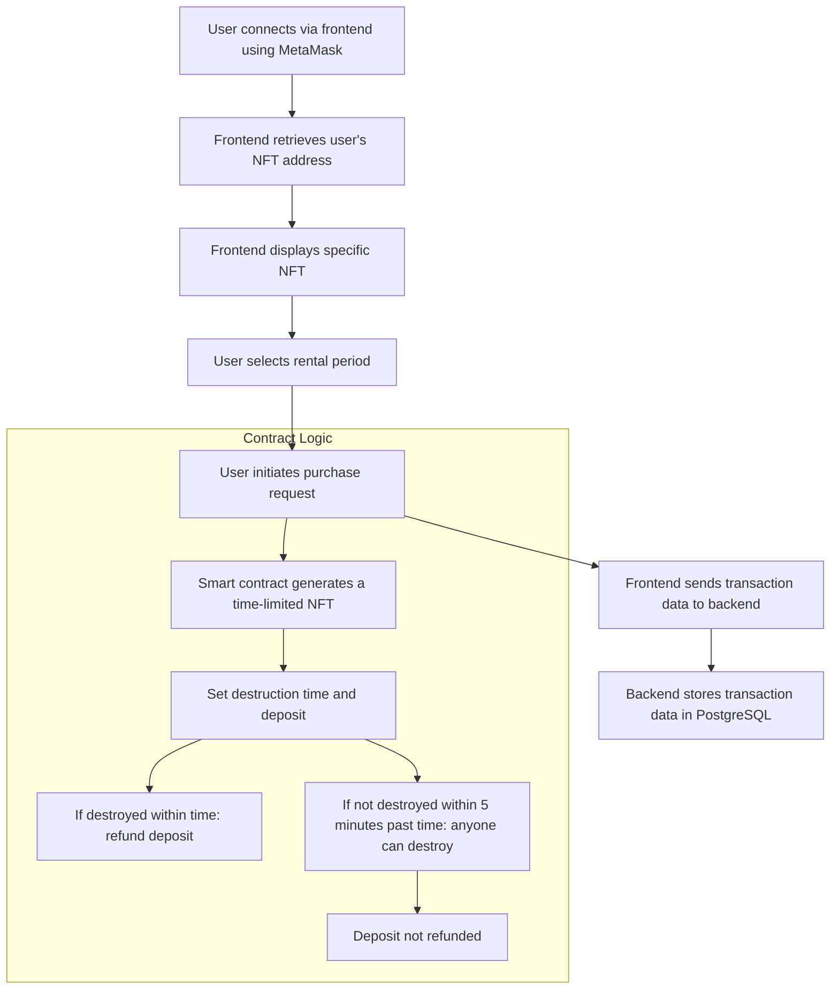

# DiagonAlley

Welcome to the **DiagonAlley** platform, a revolutionary Real World Asset (RWA) rental platform that integrates NFTs on the **Neo X** blockchain. This platform leverages blockchain's timestamping capabilities to enforce rental periods through time-limited NFTs, ensuring a secure and transparent transaction environment.

## Features

- **MetaMask Payment and Authentication**: Connect and transact on the platform using your MetaMask wallet without the need for additional login steps.
- **RWA Integration**: Real assets are represented on-chain through NFTs, allowing for the purchase and transfer of physical goods ownership via NFTs.
- **Smart Contract Management**: Our smart contracts facilitate price verification, NFT minting and transfer, and support multiple cryptocurrencies.

## Technology Stack

- **Frontend**: React.js, MetaMask API
- **Backend**: Go, Gin Framework
- **Database**: PostgreSQL (for storing transaction history and data)
- **Smart Contracts**: Solidity, Foundry development framework

## Workflow




## Smart Contract Details

- **Development Tools**: Developed and tested using **Foundry**.
- **Standards**: NFTs are minted and transferred adhering to **ERC-721** or **ERC-1155** standards.

## Backend Architecture

- **Backend Language**: Developed using **Go** and **Gin Framework**.
- **Database**: **PostgreSQL** is used as the backend database.

## Deployment and Execution

1. **Clone the project code**:
    ```bash
    git clone https://github.com/your-repo/DiagonAlley.git
    cd DiagonAlley
    ```

2. **Install backend dependencies**:
    ```bash
    go mod download
    ```

3. **Start the backend**:
    ```bash
    go run main.go
    ```
    The backend service will run at `http://localhost:2333`.

4. **Compile smart contracts**:
    Using **Foundry** for compilation and deployment:
    ```bash
    npm install package-lock.json
    forge build
    forge script deploy.s.sol:DeployContract --rpc-url <NETWORK_URL>
    ```

5. **Start the frontend**:
    ```bash
    cd front
    npm install
    npm run start
    ```
    The frontend application will run at `http://localhost:3000`.

6. **Configure the oracle**:
    Ensure the **Chainlink oracle** is configured and the oracle contract address is added to the smart contracts.

## Development Considerations

- Ensure the user's **MetaMask** is connected to the correct blockchain network.
- After deploying the smart contracts, update the contract addresses in the frontend configuration.

---

[中文版](README.zh.md)

