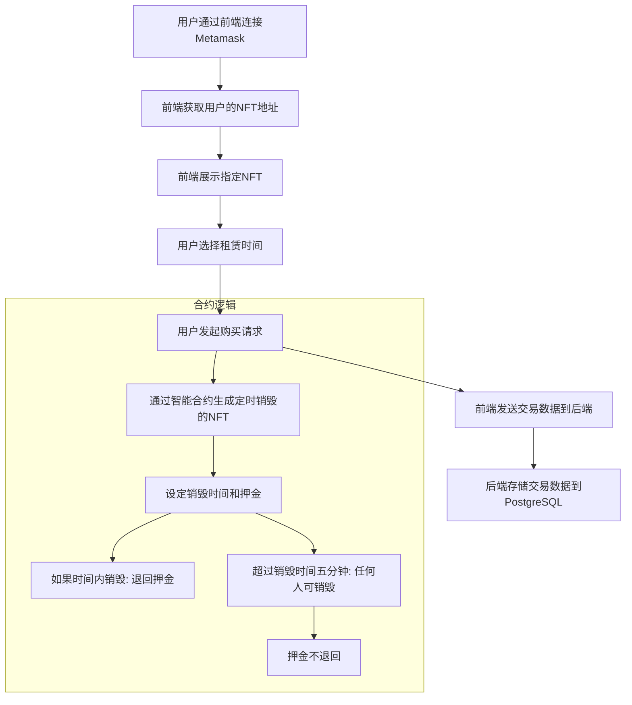

# DiagonAlley 

---

**DiagonAlley** 是基于 **Neo X** 结合了**NFT**的**RWA**租房平台。
区块链本身的时间戳功能得到近似的现实时间，结合定时瓦解的NFT做到租房的时间限制。
结合了 **区块链支付**、**智能合约**、**NFT** 和 **RWA** 的交付机制。

该平台允许用户通过 **MetaMask** 进行支付，购买 NFT 表示的商品。商家通过智能合约控制商品交付，所有交易数据记录在链上，确保交易透明、安全。

---

### 功能特性

1. **MetaMask 支付与鉴权**：用户通过 **MetaMask** 钱包连接平台进行身份验证与支付，无需额外的登录或注册步骤。
2. **RWA 集成**：真实资产通过智能合约与 NFT 链上表示，用户可以购买实体商品，商品的所有权通过 NFT 转移。
3. **智能合约管理**：智能合约用于价格验证、NFT 铸造与转移，支持多种加密货币支付。

---

### 技术栈

- **前端**：React.js, MetaMask API
- **后端**：Go, Gin 框架
- **数据库**：Mpostgresql（存储交易历史和交易数据）
- **智能合约**：Solidity, Foundry 开发框架

---

### 工作流程



---

### 智能合约细节

- **开发工具**：使用 **Foundry** 开发与测试智能合约。
- **标准**：采用 **ERC-721** 或 **ERC-1155** 标准进行 NFT 铸造与转移。

---

### 后端架构

- **后端语言**：使用 **Go** 和 **Gin 框架** 搭建后端服务。
- **数据库**：使用 **postgresql** 作为后端数据库。

---

### 部署与运行

1. **克隆项目代码**：
    ```bash
    git clone https://github.com/your-repo/DiagonAlley.git
    cd DiagonAlley
    ```

2. **安装后端依赖**：
    ```bash
    go mod download
    ```

3. **启动后端**：
    ```bash
    go run main.go
    ```
    后端服务将在 `http://localhost:2333` 运行。

4. **编译智能合约**：
    使用 **Foundry** 进行编译和部署：
    ```bash
    npm install package-lock.json
    forge build
    forge script deploy.s.sol:DeployContract --rpc-url <NETWORK_URL>
    ```
    
    >forge-std作为一个依赖项，利用git来管理依赖项的版本

5. **启动前端**：
    ```bash
    cd front
    npm install
    npm run start
    ```
    前端应用将在 `http://localhost:3000` 运行。
    需要设置对应的触发的地址。

6. **配置预言机**：
    确保 **Chainlink 预言机** 已配置好，并在智能合约中添加预言机合约地址。

---
### 开发注意事项

- 确保用户的 **MetaMask** 连接到正确的区块链网络。
- 智能合约部署完成后，更新合约地址到前端配置中。
- MongoDB 用于存储和检索交易记录，以支持 RWA 资产的交易和追踪。

---```
.

|-- README.md                  # 项目的主要文档

|-- back                       # 后端目录
|   |-- controllers
|   |   `-- purchaseController.go  # 处理购买请求的控制器
|   |-- go.mod                     # Go 语言模块依赖文件
|   |-- go.sum                     # Go 语言模块依赖校验文件
|   |-- ini
|   |   |-- config.ini             # 配置文件
|   |   `-- ini.go                 # 读取和解析 ini 配置文件的逻辑
|   |-- main.go                    # 后端服务入口文件
|   |-- model
|   |   `-- purchaseModel.go        # 购买请求的数据模型
|   `-- routers
|       `-- purchaseRouter.go       # 定义购买请求路由


|-- contracts                  # 智能合约目录

|   |-- README.md              # 项目说明文件

|   |-- foundry.toml           # Foundry 配置文件

|   |-- lib                    # 库文件目录
|   |-- script                 # 脚本目录

|   |-- src                    # 源代码目录

|   `-- test                   # 测试代码目录

|-- flow.png                   # 项目流程图

`-- front                      # 前端目录
    |-- README.md              # 前端文档
    |-- next-env.d.ts          # Next.js TypeScript 声明文件
    |-- next.config.mjs        # Next.js 配置文件
    |-- package-lock.json      # 包版本一致性文件
    |-- package.json           # 前端项目依赖和脚本
    |-- postcss.config.mjs     # PostCSS 配置文件
    |-- tailwind.config.ts     # Tailwind CSS 配置文件
    |-- tsconfig.json          # TypeScript 配置文件
    `-- src                    # 前端源代码目录
        |-- abi                # ABI 文件目录
        |   |-- NFTDestroyerABI.json
        |   `-- TransferABI.json
        |-- app                # 应用程序主要逻辑
        |   |-- components     # 组件目录
        |   |   |-- NFTGallery.tsx # 负责展示用户拥有的NFT集合。
        |   |   `-- UniqueProperties.tsx # 负责展示物业列表，并提供预订按钮。接收 onBookNow 回调函数，处理预订逻辑。
        |   |-- hooks          # 自定义钩子目录
        |   |   |-- useNFT.ts  # 负责处理与NFT相关的操作，如铸造NFT和刷新NFT列表。
        |   |   `-- useWallet.ts # 负责管理钱包的连接状态、账户信息和网络状态。
        |   |-- nft            # NFT 相关逻辑
        |   |   |-- index.tsx
        |   |   `-- nftUtils.ts # 负责与NFT相关的数据获取和处理逻辑。
        |   |-- page.tsx       # 主页面组件
        |   `-- layout.tsx     # 布局组件
        `-- components         # 通用组件目录
            `-- ui             # UI 组件
```

